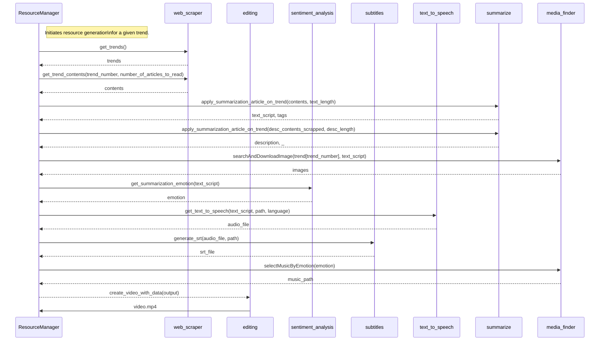

# Index

<!-- toc -->

- [FrameDeployer](#framedeployer)
  * [Overview](#overview)
  * [Features](#features)
  * [Installation](#installation)
    + [Prerequisites](#prerequisites)
- [Example of usage](#example-of-usage)
- [Documentation](#documentation)

<!-- tocstop -->

# FrameDeployer


## Overview
FrameDeployer is a tool designed to automatically create videos based on current trends. It utilizes sentiment analysis, text-to-speech, and multimedia processing techniques to generate engaging and informative videos. This project aims to simplify video content creation by automating various steps, from information retrieval to final video production.

## Features
- **Trend Analysis**: Extracts and summarizes articles based on current trends.
- **Text-to-Speech**: Converts summarized texts into audio using advanced speech synthesis techniques.
- **Subtitle Generation**: Creates synchronized subtitles for the generated videos.
- **Image Search**: Searches and downloads relevant images based on the summarized text.
- **Music Selection**: Chooses background music based on the emotion of the text.




## Installation
To set up this project, follow these steps:

### Prerequisites
Ensure you have Python 3.6+ installed on your system.

Install the required packages listed in the `requirements.txt` file. You can do this by running the following command:

```bash
pip install -r requirements.txt
```

Next, download the necessary NLTK data:

```python
import nltk
nltk.download('wordnet')
nltk.download('framenet_v17')
nltk.download('punkt')
```

Now you have to install ImageMagick [clicking here](https://imagemagick.org/script/download.php). If you're on Windows you have to link the path of the executable you've installed in ```conf.py```:

```python
IMAGEMAGICK_BINARY = r"INSERT/YOUR/PATH/HERE.exe"
```

You have also to add your API key of assemblyAI transcriber engine in ```data/var.env```:

```env
aai="your-api-key"
```


# Example of usage

> [!NOTE]
>
> The project is currently under development. The example of usage will come when the final build will be released.

# Documentation

> [!NOTE]
>
> The project is currently under development. The documentation will come when the final build will be released.

